# Newsdatadb.py
---

Newsdatadb.py is a simple program that queries a fictional media company's database which stores all it's author info, articles, and website HTTP requests. The purpose of this project is to aggregate site usage metrics and answer three basic questions:

"What are the most popular three articles of all time?"

"Who are the most popular article authors of all time?"

"On which days did more than 1% of requests lead to errors?"


### Dependencies / Setup

+ psycopg2 (PostgreSQL Adapter for Python)
+ Vagrant/Virtual Box
+ PostgreSQL database server

This program was tested using Oracle VirtualBox (Linux: Ubuntu) VM environment, configured with Vagrant. 

You can download VirtualBox [here](https://www.virtualbox.org/wiki/Download_Old_Builds_5_1).

Vagrant can be downloaded [here](https://www.vagrantup.com/downloads.html).

Udacity provides a Vagrant configuration file, packaged with a PostgreSQL server and a database called "news". Python interpreter 2.7.12 is also included in the VM configuration. The Vagrant file is available on GitHubto be forked and cloned [here](https://github.com/udacity/fullstack-nanodegree-vm). 

Once the Vagrant configuration file has been downloaded, open your CLI and navigate to the directory containing "Vagrantfile".

Ex:

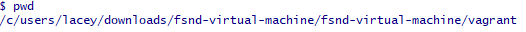

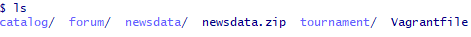


To initialize the virtual machine, run the `vagrant up` command. This process can take several minutes:

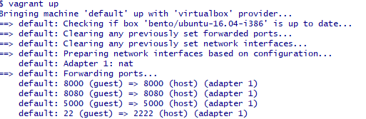


After initialization is complete, connect to the VM using `vagrant ssh`.

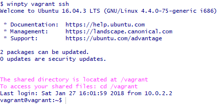

 _Note: If you are using bash on Windows you may have to use `winpty vagrant ssh` to successfully connect to the VM._


The "news" database initially contains no tables or data. Udacity provides a .sql file containing PSQL statements that create and populate the tables. 

From the CLI, in the vagrant directory, `psql -d news -f newsdata` connects to the "news" database and executes the statements contained in "newsdata.sql".


###PostgreSQL Database

---

After executing the PSQL statements contained in "newsdata.sql", the following tables are now available for manipulation:

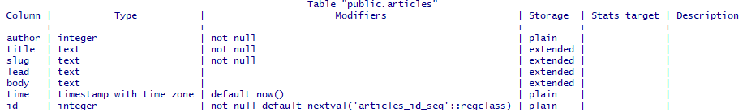
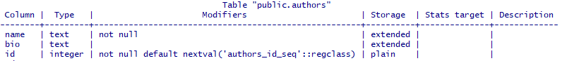
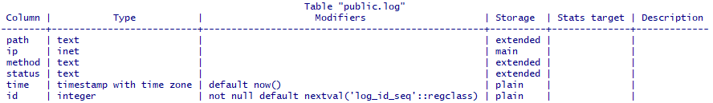


Below are the project questions and hierarchical lists of views used to retrieve the data necessary to answer them.


#### "What are the most popular three articles of all time?"


`get_slug_log_path`: matches articles.slug with formatted log.path to determine amount of views per article
  
```
CREATE VIEW get_slug_log_path AS SELECT replace(path, '/article/', '') AS slug_path, count(path) AS path_count FROM log 
WHERE path LIKE '%article%' AND status LIKE '%200%' 
GROUP BY slug_path ORDER BY path_count;

```
`SELECT * FROM get_slug_log_path;`

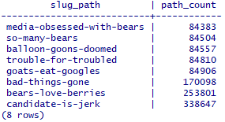

`article_popularity` (Answer)

```
CREATE VIEW article_popularity AS SELECT articles.title, get_slug_log_path.path_count FROM articles 
LEFT JOIN get_slug_log_path 
ON articles.slug = get_slug_log_path.slug_path 
GROUP BY articles.title, get_slug_log_path.path_count 
ORDER BY get_slug_log_path.path_count DESC 
LIMIT 3;

```
`SELECT * FROM article_popularity;`

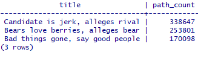

---

#### "Who are the most popular article authors of all time?"


`author_to_slug`: joins articles and and authors, matching author IDs to their respective articles in the articles table.

```
CREATE VIEW author_to_slug AS SELECT authors.name, article.slug FROM authors JOIN articles
ON authors.id = articles.author
GROUP BY authors.name, articles.slug
ORDER BY authors.name;
```

`SELECT * FROM author_to_slug;`

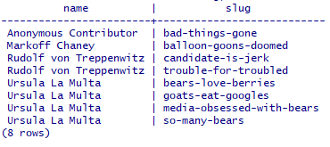

`author_popularity` (Answer)

```
CREATE VIEW author_popularity AS SELECT author_to_slug.name AS author, sum(get_slug_log_path.path_count) 
AS views FROM author_to_slug JOIN  get_slug_log_path 
ON author_to_slug.slug = get_slug_log_path.slug_path
GROUP BY author_to_slug.name
ORDER BY views DESC;

```

`SELECT * FROM author_popularity;`

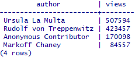

---


#### "On which days did more than 1% of requests lead to errors? (404)"


`date_total_status`:  Casts timestamp field to date type and counts ALL HTTP statuses.

```
CREATE VIEW date_total_status AS SELECT date(time) AS
date, count(status) AS status_count 
FROM log GROUP BY date 
ORDER BY date;

```

`SELECT * FROM date_total_status;`

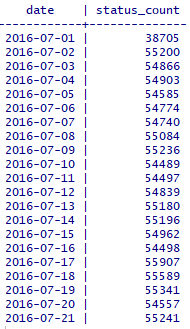


`date_total_404_count`: Casts timestamp field to date type and aggregates all 404 statuses from log table, grouping by date.

```
CREATE VIEW date_total_404_count AS SELECT date(time) AS date, count(status) as count_404 
FROM log WHERE status LIKE '%404%' 
GROUP BY date 
ORDER BY date;

```
`SELECT * FROM date_total_404_count;`

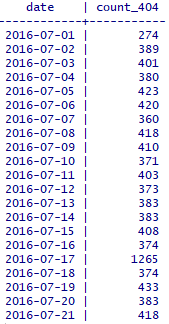

`date_404_and_total`: Joins date_total_status and date_total_404_count tables.

```
CREATE VIEW date_404_and_total AS SELECT date_total_404_count.date, 
cast(date_total_status.status_count AS float) AS total_status, 
cast(date_total_404_count.count_404 AS float) AS count_404 FROM date_total_404_count 
JOIN date_total_status 
ON date_total_status.date = date_total_404_count.date 
ORDER BY date_total_404_count.date;

```
`SELECT * FROM date_404_and_total;`

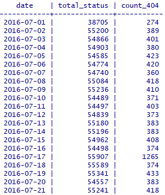

`percentage_404_date` (Answer)

```
CREATE VIEW percentage_404_date AS SELECT to_char(date, 'Mon DD, YYYY'), 
to_char((count_404 / total_status) * 100, '99.9') AS percentage_404 
FROM date_404_and_total 
WHERE (count_404 / total_status) * 100 > 0.99
ORDER BY date;

```

`SELECT * FROM percentage_404_date;`

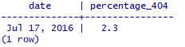


### Execution

---

Execution is simple. After connecting to the VM via `vagrant ssh`, navigate to the "vagrant/" directory. Here, you can access files shared between the VM and the host. Navigate further down into "newsdata/" where "newsdatadb.py" is located. Run the program with `./newsdatadb.py`. Program output will be as follows: 

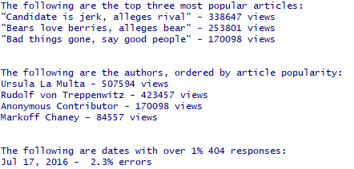


"Output.txt" is also available in this repository for reference.
